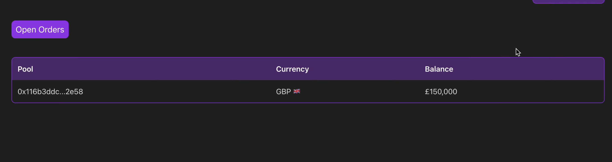

# OpenBanking Solidity Onramp

1. Settles ZK Proofs of Bank Transactions via Signed OpenBanking API through a Noir<> Solidity Verifier
2. Uses zk proofs to handle noncustodial escrow/ swaps of offchain fiat and onchain tokens
3. Dormant capital waiting in escrow is supplied to (mocked) aave pool to provide extra incentive to provide offramp liquidity
4. Uses Forte Rules Engine to enforce (mocked) OFAC oracle calls when trying to register to use the application to provide compliance with OpenBanking API requirements

## Run instructions
1. `(cd circuit && ./build.sh)`
2. `yarn` (or npm or whatever)
3. `yarn test`

Runs a full, e2e demonstration of
1. locking funds in escrow (offramp perspective, will recieve bank fiat in exchange for tokens)
2. depositing dormant funds in mocked aave
3. proving correctness of openbanking proof in Noir
4. verifying openbanking proof in solidity
5. withdrawing funds locked in aave and releasing escrow (onramp perspective, recieved tokens in exchange for bank fiat)

## Forte Integration
OpenBanking PSD2 Licensing used for our ZK Bank Proofs. In order to comply and maintain access to the OpenBanking API, OFAC sanction checking is required (among many other tools in actual production). We mock an [OFAC Oracle](./contracts/MockOfacSanction.sol), then define a [policy](./policy.json) with a Forte foreign call that simply checks for ofac sanctinoing of a caller address.

Then, we added a registration function to the [escrow](./contracts/Escrow.sol) which has a forte modifier appended to it. This forces each user callling register to check make a foreign call through the rules engine to the ofac sanction list, which is denied access if an address is in the ofac sanction list.

Calling register places users in a whitelist which is then checked when calling deposit or withdraw later on. While the contents of the OFAC oracle is mocked (not real OFAC list) for the sake of the hackathon, this demo demonstrates an end-to-end integration of the Forte Rules Engine to facilitate 

## UI Mocks
Im running out of time sorry

View taking escrow

Starting escrow claim

Revolut payment flow
